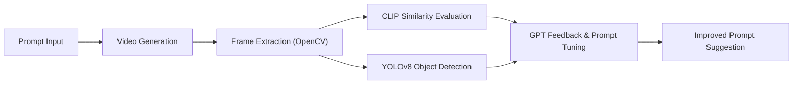

# 🎬 Prompt Evaluation & Tuning System for Generative Video AI

> Analyze and optimize prompts for generative video AI (e.g. Sora, HunyuanVideo, Runway) using CLIP, YOLO, and GPT.

---

## 📌 Overview

This project develops a **closed-loop evaluation and tuning system** for generative video AI. It quantifies how well a text prompt is reflected in a generated video and suggests improved prompts using:

- **CLIP-based semantic similarity**
- **YOLO-based object presence detection**
- **GPT-based feedback and rewriting**

---

## 🧠 Motivation

Generative video models often fail to fully reflect user intent, and current evaluation relies heavily on subjective judgment.

We aim to:

- Provide a **quantitative measure** of prompt-video alignment  
- Detect whether **key objects** in the prompt appear in the video  
- Offer **automated improvements** using LLM-based feedback  

---

## ⚙️ System Architecture



---

## 💾 Modules

### 1. CLIP-Based Similarity Analysis
- Use **CLIP ViT-B/32** to compute frame-wise prompt similarity
- Analyze **semantic consistency over time** with line plots


### 2. Object Detection via YOLOv8
- Extract key nouns from the prompt (e.g. "dog", "forest")
- Use **YOLOv8m** to detect object presence in each frame
- 


### 3. GPT-Based Feedback & Prompt Tuning
- Summarize gaps: missing objects, low similarity areas
- Automatically generate revised prompts with **GPT-4**

### 4. Visualization (Streamlit UI)
- Graphs for CLIP score timeline
- Tables for object appearance summary
- Text output for GPT prompt feedback and suggestions

---

## 🔧 Tech Stack

- **Language**: Python 3.10.11  
- **Libraries**: OpenCV, PyTorch, Huggingface Transformers, Streamlit  
- **Models**: CLIP (ViT-B/32), YOLOv8m, GPT-4  
- **Hardware**: Intel i9-13900, NVIDIA RTX 4080  

---

## 🗂 Project Structure

```
project-root/
├── input/                     # Raw videos
├── frames/                    # Extracted frame images
├── results/
│   ├── clip_scores.json
│   ├── yolo_objects.json
│   └── gpt_feedback.txt
├── utils/
│   ├── clip_eval.py
│   ├── yolo_detect.py
│   └── prompt_parser.py
├── streamlit_app.py           # UI Dashboard
├── main.py                    # End-to-end runner
├── requirements.txt
└── README.md
```

---


## 📈 Outcomes

- Fully automated **prompt evaluation pipeline**
- Object-aware prompt tuning via GPT
- Compatibility with multiple generative video models
- Useful for **education**, **research**, and **content QA**

---

## 👥 Team

| Name           | Role & Expertise |
|----------------|------------------|
| 김주형 (Juhyeong Kim) | Prompt pipeline, Video AI integration |
| 김경현 (Kyunghyun Kim) | CLIP/YOLO analysis, GPT tuning, Streamlit UI |

---

## 🖼 Screenshots

> *(
)*

---

## 📚 References

For full academic citations, see [`docs/references.md`](./docs/references.md)

---

## 📜 License

This project is licensed under the **MIT License**. Feel free to use, modify, and distribute it.

---

